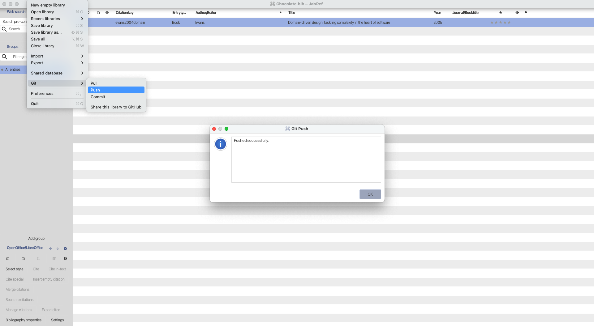

Final Report GSoC 2025 - Git Support for JabRef

| Field                  | Information                                                                                                                                                                                                      |
| ---------------------- | ---------------------------------------------------------------------------------------------------------------------------------------------------------------------------------------------------------------- |
| **Student**            | [Wanling Fu](https://github.com/wanling0000)                                                                                                                                                                     |
| **Organization**       | [JabRef e.V.](https://www.jabref.org/)                                                                                                                                                                           |
| **Primary repository** | [JabRef/Jabref](https://github.com/JabRef/jabref)                                                                                                                                                                |
| **Project name**       | Git Support for JabRef                                                                                                                                                                                           |
| **Project mentors**    | [@koppor](https://github.com/koppor), [@subhramit](https://github.com/subhramit), [@InAnYan](https://github.com/InAnYan), [@calixtus](https://github.com/calixtus), [@Siedlerchr](https://github.com/Siedlerchr) |
| **Project page**       | [Google Summer of Code 2025 Project Page](https://summerofcode.withgoogle.com/programs/2025/projects/R9UcJNpJ)                                                                                                   |
| **Status**             | Complete                                                                                                                                                                                                         |

---

## Project summary

To support version control and collaborative editing of `.bib` libraries, this project adds Git integration to JabRef and introduces a semantic merge mechanism to improve the merging experience.

The project includes the following key features:

**1. Semantic three-way merge:**

Instead of using Git’s default line-based diff and merge, this project implements a structure-aware merge based on BibEntry. It detects field-level conflicts. If a conflict is found, JabRef shows a GUI dialog for the user to resolve it. If not, the system merges and commits the changes automatically without user input.

**2. Basic Git operations:**

- **Share to GitHub:** Initialize a local repository and push it to GitHub using a Personal Access Token (PAT).

- **Git Commit:** Commit changes to the currently opened `.bib` file.

- **Git Push:** Push local commits to the remote repository.

- **Git Pull:** Fetch and merge changes from the remote, using semantic conflict detection.

## Pull requests to _main_ branch

### Scope - GSoC

#### [#13518](https://github.com/JabRef/jabref/pull/13518) - logic orchestration for Git Pull/Push operations

**Highlights:**

- Introduced `GitSyncService` as the central orchestrator for Git operations, managing pull, push, and semantic merge processes.

  - Implemented semantic three-way merge logic for `.bib` entries based on structured comparison of base, local, and remote versions.

  - Field-level conflicts are detected and resolved.

- Added logic-layer modules and classes to handle Git tasks, with supporting unit tests:

  - `git.status`: detects Git tracking status, sync state, and conflicts.

  - `git.io`: handles reading and writing historical `.bib` versions.

  - `git.conflicts`: defines conflict detection and resolution strategies.

  - `git.merge`: generates and applies semantic merge plans.

- Followed test-driven development using `GitSyncServiceTest`, simulating multi-user scenarios to verify semantic merge behavior.

#### [#13666](https://github.com/JabRef/jabref/pull/13666) - Decouple `GitHandler` creation and extend semantic conflict detection

**Highlights:**

- Introduced `GitHandlerRegistry` to ensure a single `GitHandler` instance per repository path, avoiding inconsistent state or duplicated work.

- Improved semantic conflict detection:
  - Handled more edge cases in entry-level merging.
  - Extended test coverage:
    - `SemanticConflictDetectorTest` now covers both entry-level and field-level - semantic conflict scenarios.
    - Added a detailed classification table in the developer documentation, defining conflict types and expected resolution rules for three-way semantic merges.

#### [#13677](<[https://github.com/JabRef/jabref/pull/13677](https://github.com/JabRef/jabref/pull/13677)>) - Implement “Share this library to GitHub” feature

**Highlights:**

- Added a GUI dialog for sharing `.bib` libraries to GitHub:

  - Users provide the GitHub HTTPS URL, username, and PAT to connect and push.

  - Supports credential storage, remote validation, and warnings for non-empty remotes.

  - Includes helpful links to GitHub PAT creation and repository setup.

- Automatically initializes and pushes the local repository if not already set up.

- Introduced `GitPreferences` to securely store GitHub credentials.

#### [#13743](https://github.com/JabRef/jabref/pull/13743) - Add Git Commit support

**Highlights:**

- Added a GUI menu item (File → Git → Commit) with a dialog for entering commit messages and submitting changes.

#### [#13744](https://github.com/JabRef/jabref/pull/13744) - Implement Git Pull and Push features

**Highlights:**

- Git Pull:
  - Detects new commits from upstream (via fetch + status).
  - Uses semantic merging for `.bib` files to compare and merge fields.
    - If no conflicts: automatically merges and commits.
    - If conflicts are detected: opens a three-way merge dialog.
- Git Push:
  - Pushes the current branch to the remote repository.
  - Prevents pushing if there are unresolved conflicts or uncommitted changes.

### Outside core scope

#### [#13775](<[https://github.com/JabRef/jabref/pull/13775](https://github.com/JabRef/jabref/pull/13775)>) - Restore local-only Git behavior for SLR to fix repository initialization error

fixes a regression where the `GitHandler.pullOnCurrentBranch()` method was modified to support remote repositories.

### Before GSoC

#### [#13040](https://github.com/JabRef/jabref/pull/13040) - Fix: fallback conversion from BibTeX year field to biblatex date field

#### [#12866](<[https://github.com/JabRef/jabref/pull/12866](https://github.com/JabRef/jabref/pull/12866)>) - Add support for loading .blg warnings in Integrity Check Dialog

#### [#12802](<[https://github.com/JabRef/jabref/pull/12802](https://github.com/JabRef/jabref/pull/12802)>) - Fix for issue: Sanitization of generated filenames (remove LaTeX commands)

## Screenshots

1. Share to GitHub

2. Git Commit

3. Git Push/Pull with Semantic Merge

- without semantic conflict

- with semantic conflict

## Future work

While the current implementation of Git integration in JabRef covers the core logic and GUI support for Pull, Push, and semantic Merge, there remain several areas for future improvement and expansion:

**Feature enhancements**

- Automatically detect whether the currently opened `.bib` file is under Git version control and display its status in the GUI (e.g., ahead/behind, conflict state). If an error occurs, users should be notified and the file should be safely reverted.

- Implement a CLI-based conflict resolver (`CliGitConflictResolverStrategy`) to support Git merging in command-line environments such as JabKit.

- Allow Git settings to be configured on a per-library preferences instead of globally, so different `.bib` files can use different repositories and remotes.

Other feature requests and bug reports are tracked at: [https://github.com/wanling0000/jabref/issues](https://github.com/wanling0000/jabref/issues)

**Technical cleanup**

- Remove leftover TODO comments in the codebase, especially:

- Clearly define when the “Git Share” feature should be enabled (e.g., whether the repository is initialized, remote is set).

- Remove the use of environment variables (e.g., `GIT_EMAIL`, `GIT_PW`) for credentials in SLR-related code; unify credential handling through `GitPreferences`.

**Architectural improvements**

- `GitSyncService` currently mixes responsibilities including status checking, merge planning, and execution:

- It could be refactored into separate components such as Planner / Executor / Orchestrator.

- Configurable options should be introduced (e.g., whether to auto-amend, how to generate default commit messages) instead of hardcoded behavior.

- Reduce tight coupling between `GitHandler` and the Systematic Literature Research (SLR) component, and clearly define interaction boundaries.

These future improvements will further enhance JabRef’s Git-based collaboration capabilities and improve the maintainability and extensibility of the system.

## Challenges and important things I learned during the project

Throughout this GSoC project, I worked on integrating Git functionality into JabRef. This experience helped me grow significantly in many areas:

- I gained a deeper understanding of how Git works internally, and how to programmatically interact with Git repositories using JGit.

- While implementing semantic merge logic, I developed a clearer grasp of how three-way merges work, especially how to detect and handle merge conflicts.

- I practiced JavaFX’s property binding and event-listening mechanisms, and strengthened my understanding of the MVVM architectural pattern for building modern GUIs.

- I learned how to use JavaFX Task in background threads, ensuring that the UI remains responsive while safely updating the GUI with results.

- I improved my ability to work in a large, modular codebase like JabRef, where clean architecture boundaries, layered dependencies, and testable code are critical. This also helped me become more comfortable with reading, navigating, and refactoring existing code written by others.

- Most importantly, I experienced real open-source collaboration: submitting pull requests, receiving and responding to reviews, and communicating with mentors and maintainers. Being part of open-source community also allowed me to connect with people I would never have crossed paths with in real life, which I found surprising.

I sincerely thank my GSoC mentors [@koppor](https://github.com/koppor), [@subhramit](https://github.com/subhramit), [@InAnYan](https://github.com/InAnYan), [@calixtus](https://github.com/calixtus), [@Siedlerchr](https://github.com/Siedlerchr) for their patience, support, and guidance throughout the project. They not only helped me overcome technical challenges but also taught me valuable lessons in project management, code quality, and open-source contribution.
